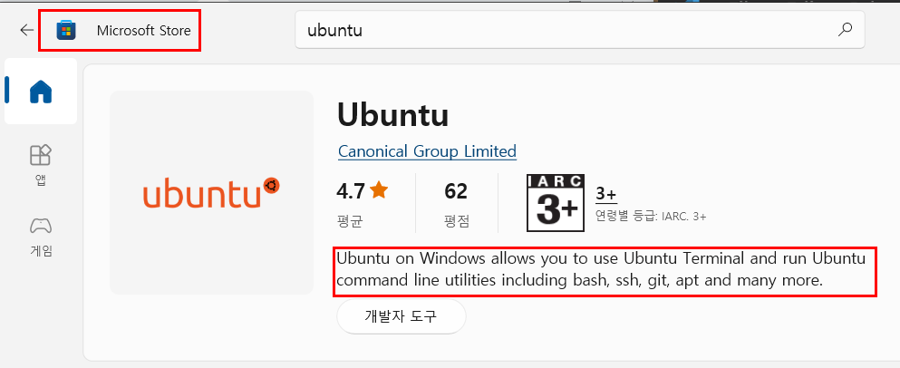
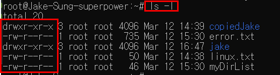
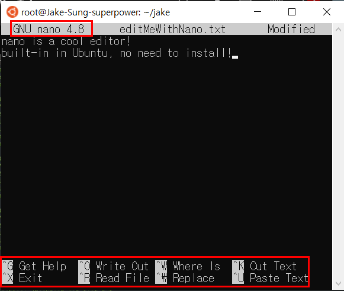
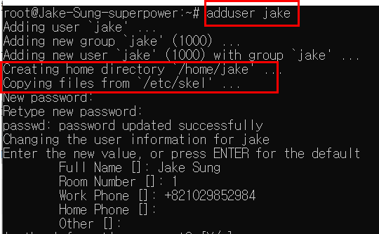

# Learning Linux essentials
> Linux is a family of open-source Unix-like operating systems based on the Linux kernel, an operating system kernel first released on September 17, 1991, by Linus Torvalds. Linux is typically packaged in a Linux distribution.

## Linux history
> During the formative years of the computer industry, one of the early operating systems was called Unix. It was designed to run as a multi-user system on mainframe computers, with users connecting to it remotely via individual terminals. These terminals were pretty basic by modern standards: just a keyboard and screen, with no power to run programs locally. 

> Instead they would just send keystrokes to the server and display any data they received on the screen. There was no mouse, no fancy graphics, not even any choice of colour. Everything was sent as text, and received as text. Obviously, therefore, any programs that ran on the mainframe had to produce text as an output and accept text as an input.

### Shell
> The original Unix shell program was just called sh, but it has been extended and superceded over the years, so on a modern Linux system you’re most likely to be using a shell called bash.

### Advantage of using text in terminal
> Compared with graphics, text is very light on resources. Even on machines from the 1970s, running hundreds of terminals across glacially slow network connections (by today’s standards), users were still able to interact with programs quickly and efficiently. 

> The commands were also kept very terse to reduce the number of keystrokes needed, speeding up people’s use of the terminal even more. This speed and efficiency is one reason why this text interface is still widely used today.

> When logged into a Unix mainframe via a terminal users still had to manage the sort of file management tasks that you might now perform with a mouse and a couple of windows. Whether creating files, renaming them, putting them into subdirectories or moving them around on disk, users in the 70s could do everything entirely with a textual interface.

### Linux as a descendent of Unix
> Linux is a sort-of-descendent of Unix. The core part of Linux is designed to behave similarly to a Unix system, such that most of the old shells and other text-based programs run on it quite happily. 

> In theory you could even hook up one of those old 1970s terminals to a modern Linux box, and access the shell through that. But these days it’s far more common to use a software terminal: that same old Unix-style text interface, but running in a window alongside your graphical programs. Let’s see how you can do that yourself!

## Ubuntu
> Ubuntu is a Linux distribution based on Debian and composed mostly of free and open-source software. Ubuntu is officially released in three editions: Desktop, Server and Core for Internet of things devices and robots. All the editions can run on the computer alone, or in a virtual machine. Ubuntu is a popular operating system for cloud computing, with support for OpenStack. Ubuntu's default desktop has been GNOME since version 17.10.

1. Desktop : Download Ubuntu desktop and replace your current operating system whether it’s Windows or macOS or run Ubuntu alongside it.

1. Server : Whether you want to configure a simple file server or build a fifty thousand-node cloud, you can rely on Ubuntu Server and its five years of guaranteed free upgrades.

1. Cloud : Ubuntu is the reference OS for OpenStack. Try Canonical OpenStack on a single machine or start building a production cloud on a cluster — just add servers.

### Why Ubuntu?
1. Provides the fastest route from development to deployment on desktop, mobile, server or cloud
1. Offers the broadest and best development tools and libraries
1. Has all the most popular productivity apps such as Slack, Skype, Telegram and Discord, available in the snap store
1. Features official snaps for Visual Studio Code and the JetBrains suite of IDEs
1. Makes for hassle free gaming and AI development with NVIDIA GPUs supported out the box
1. Certified AI and developer laptops and workstations are available from Dell, Lenovo and HP – get a seamless, pre-installed Ubuntu experience
1. The lightweight OS runs natively or in a VM, ideal for any resource-intensive environment, from data mining to large-scale financial modelling
1. 66% of experienced developers prefer Ubuntu

## Installation
Go to Microsoft store and install Ubuntu LTS. 



> Ubuntu on Windows allows you to use Ubuntu Terminal and run Ubuntu command line utilities including bash, ssh, git, apt and many more. Please note that Windows 10 S does not support running this app.

> To launch, use "ubuntu" on the command-line prompt (cmd.exe), or click on the Ubuntu tile in the Start Menu. To use this feature, one first needs to use "Turn Windows features on or off" and select "Windows Subsystem for Linux", click OK, reboot, and use this app.

> The above step can also be performed using Administrator PowerShell prompt: Enable-WindowsOptionalFeature -Online -FeatureName Microsoft-Windows-Subsystem-Linux

> This app installs the Ubuntu 20.04 LTS release on Windows. Please note that app updates don't change the Ubuntu installation. To upgrade to a new release please run do-release-upgrade in the Ubuntu Terminal.

## Basic commands
- pwd : print working directory
```shell
# /root/jake
$pwd
```

- ls : list items in a current directory. 

```shell 
# list all items in root
$ls /
# list all items including hidden ones
$ls -a
# list itmes in a long listing format(including permission)
$ls -l
```



- mkdir : make a directory

```shell
# single directory
$mkdir jake
# nested directories
$mkdir -p jake/is/awesome
```

- rmdir : remove a directory
- clear : clear terminal
- cd : change directory

```shell
# ~ means home in Linux. 
$cd ~
```

- whoami : shows username
- touch : create a file
- rm : remove a file

```shell
# create a file called test.txt
$touch test.txt
# remove the file 
$rm test.txt
# remove recursively(remove anything inside the directory)
$rm -r testDir
```

- cat : read a file
- mv : move a file to a directory

```shell 
# move a jake.txt file(source) to notJake directory(destination)
$mv jake.txt notJake
# rename a jake.txt to notJake.txt
$mv jake.txt notJake.txt
```

- man : checks a manual for command
```shell 
# fetch a command manual for mv
$man mv
```

<details>
<summary>hidden files in Linux</summary>

Linux makes a file hidden when the file name is prefixed with '.'. For example, 

```shell 
# hidden file
.vscode 
```
</details>

- cp : copy files and directories. (thing to copy / where to copy)

```shell
# copy linux.txt to copyDir
$cp linux.txt ./copyDir

# copy recursively
$cp -r myDir ./newMyDir
```

- nano : call nano editor and start editing.

```shell
# edit linux.txt with nano editor
$nano linux.txt
```



## Shell feature
> In Linux, stdin is the standard input stream. This accepts text as its input. Text output from the command to the shell is delivered via the stdout (standard out) stream. Error messages from the command are sent through the stderr (standard error) stream.

> These values are always used for stdin, stdout, and stderr

- 0: stdin
- 1: stdout
- 2: stderr

### Handling stdin
```shell
# echo as stdout : >
$echo "this is the message text" > message.txt

# message.txt as stdin 
$mail -s "email sent" jake < message.txt
```

### Handling stdout

```shell
# create a stdin
$echo "hello world"

# toss it to stdout : create a helloWorld.txt whose body is "hello world"
$echo "hello world" 1>helloWorld.txt

# stdout can be omitted
$echo "hello world" > helloWorld.txt

# create if not exists , append if exists
$echo "goodbye world" >> helloWorld.txt
```

### Handling stderr

```shell
# save ls result to stdout myDirList
$ls > myDirList
# read the stdout myDirList
$cat myDirList
# wrong command to write stderr. the result of lsss is saved in err.txt
$lsss 2> err.txt
# check the stderr
$cat err.txt
```

### Handling pipe
> The Pipe is a command in Linux that lets you use two or more commands such that output of one command serves as input to the next. In short, the output of each process directly as input to the next one like a pipeline. The symbol ‘|’ denotes a pipe.

> Pipes help you mash-up two or more commands at the same time and run them consecutively. You can use powerful commands which can perform complex tasks in a jiffy.

```shell
# read error.txt all at once 
$cat error.txt 

# read error.txt per page, exit with q
# take cat's output and deliver to less as input.
$cat error.txt | less
```

## Filter output
You can combine multiple commands to filter things out. 

```shell
# create a test.txt and read it. 
$touch test.txt && cat test.txt
```

### Cut
Cut is used to cut fields. If test.txt contains the following texts, 
```
line one: jake
line two: sung
line three: cool
```

then it can be cut out with below command,

```shell
$cat test.txt | cut -d: -f 2
```

and it came out as 
```
 jake
 sung
 cool
```

### Grep
grep is a searching command. For example, 

```shell
$cat test.txt | grep jake
```

and then it will come out as, 

```
line one: jake
```

You can find all matches with ./* options. 

```shell 
$grep jake ./*
```

and then result will be like, 

```
./cut.txt:line one: jake
./cut.txt:line four : not jake
```

## Package management
> Ubuntu’s package management system is derived from the same system used by the Debian GNU/Linux distribution. The package files contain all of the necessary files, meta-data, and instructions to implement a particular functionality or software application on your Ubuntu computer.

> Debian package files typically have the extension .deb, and usually exist in repositories which are collections of packages found online or on physical media, such as CD-ROM discs. Packages are normally in a pre-compiled binary format; thus installation is quick and requires no compiling of software.

> Many packages use dependencies. Dependencies are additional packages required by the principal package in order to function properly. For example, the speech synthesis package festival depends upon the package alsa-utils, which is a package supplying the ALSA sound library tools needed for audio playback. In order for festival to function, it and all of its dependencies must be installed. The software management tools in Ubuntu will do this automatically.

### Apt : Advanced Packaging Tool
> The apt command is a powerful command-line tool, which works with Ubuntu’s Advanced Packaging Tool (APT) performing such functions as installation of new software packages, upgrade of existing software packages, updating of the package list index, and even upgrading the entire Ubuntu system.

1. Install a package : Installation of packages using the apt tool is quite simple. For example, to install the nmap network scanner, type the following:

```shell
$sudo apt install nmap
```

1. Remove a Package: Removal of a package (or packages) is also straightforward. To remove the package installed in the previous example, type the following:

```shell
$sudo apt remove nmap
```

1. Update the Package Index: The APT package index is essentially a database of available packages from the repositories defined in the /etc/apt/sources.list file and in the /etc/apt/sources.list.d directory. To update the local package index with the latest changes made in the repositories, type the following:

```shell
$sudo apt update
```

> Scripting: While apt is a command-line tool, it is intended to be used interactively, and not to be called from non-interactive scripts. The apt-get command should be used in scripts (perhaps with the --quiet flag). For basic commands the syntax of the two tools is identical.

## User management
> User management is a critical part of maintaining a secure system. Ineffective user and privilege management often lead many systems into being compromised. Therefore, it is important that you understand how you can protect your server through simple and effective user account management techniques.

### Root
> Ubuntu developers made a conscientious decision to disable the administrative root account by default in all Ubuntu installations. This does not mean that the root account has been deleted or that it may not be accessed. It merely has been given a password hash which matches no possible value, therefore may not log in directly by itself.

> Instead, users are encouraged to make use of a tool by the name of ‘sudo’ to carry out system administrative duties. Sudo allows an authorized user to temporarily elevate their privileges using their own password instead of having to know the password belonging to the root account. This simple yet effective methodology provides accountability for all user actions, and gives the administrator granular control over which actions a user can perform with said privileges.

Modify user account with usermod command. For example, you can assign sudo previlege to an account like below. 

```shell 
# in root account, 
$usermod -aG sudo (username)
```

And then switch to the account to do things. 

```shell
# -l : login flag => Start the shell as a login shell with an environment similar to a real login:
$su -l (username)
```

### Adding and Deleting Users
> The process for managing local users and groups is straightforward and differs very little from most other GNU/Linux operating systems. Ubuntu and other Debian based distributions encourage the use of the ‘adduser’ package for account management.

> To add a user account, use the following syntax, and follow the prompts to give the account a password and identifiable characteristics, such as a full name, phone number, etc.

```shell 
$sudo adduser (username)
```



```shell 
$sudo deluser (username)
```

> Deleting an account does not remove their respective home folder. It is up to you whether or not you wish to delete the folder manually or keep it according to your desired retention policies. Remember, any user added later on with the same UID/GID as the previous owner will now have access to this folder if you have not taken the necessary precautions.

Once a new user is created, you can switch to the user from root with below command,

```shell
$su -l (username)
```

## User profile security
> When a new user is created, the adduser utility creates a brand new home directory named /home/username. The default profile is modeled after the contents found in the directory of /etc/skel, which includes all profile basics.

> If your server will be home to multiple users, you should pay close attention to the user home directory permissions to ensure confidentiality. By default, user home directories in Ubuntu are created with world read/execute permissions. This means that all users can browse and access the contents of other users home directories. This may not be suitable for your environment.

## Permission
> In Linux and Unix, everything is a file. Directories are files, files are files and devices are files. Devices are usually referred to as a node; however, they are still files. All of the files on a system have permissions that allow or prevent others from viewing, modifying or executing. If the file is of type Directory then it restricts different actions than files and device nodes. 

> The super user "root" has the ability to access any file on the system. Each file has access restrictions with permissions, user restrictions with owner/group association. Permissions are referred to as bits.

> To change or edit files that are owned by root, sudo must be used - please see RootSudo for details. If the owner read & execute bit are on, then the permissions are:

```
-r-x------
```

### Restriction
> There are three types of access restrictions:

|Permission|Action    |chmod option|
|:--------:|:--------:|:----------:|
|read      |(view)    |r or 4      |
|write     |(edit)    |w or 2      |
|execute   |(execute) |x or 1      |

> There are also three types of user restrictions:

|User     |ls output |
|:-------:|:--------:|
|owner    |-rwx------|
|group    |----rwx---|
|other    |-------rwx|

> Directories have directory permissions. The directory permissions restrict different actions than with files or device nodes. Write access for a directory allows deleting of files in the directory even if the user does not have write permissions for the file!

### Changing permission
> The command to use when modifying permissions is chmod. There are two ways to modify permissions, with numbers or with letters. Using letters is easier to understand for most people. When modifying permissions be careful not to create security problems. Some files are configured to have very restrictive permissions to prevent unauthorized access. For example, the /etc/shadow file (file that stores all local user passwords) does not have permissions for regular users to read or otherwise access.

|Owner       |Group       |Other                |
|:----------:|:----------:|:-------------------:|
|read & write|read & write|read, write & execute|
|4+2=6       |4+2=6       |4+2+1=7              |

> For example if you want a file that has -rw-rw-rwx permissions you will use the following:

```shell
# owner : read(4) & write(2) => 4+2 = 6 
# group : read(4) & write(2) => 4+2 = 6
# others : read(4) & write(2) & execute(1) => 4+2+1 = 7
$chmod 667 filename
```


## Reference
- [Linux basic course - tutoriaLinux](https://youtube.com/playlist?list=PLtK75qxsQaMLZSo7KL-PmiRarU7hrpnwK)
- [Linux Command Line Tutorial For Beginners | Bash Terminal | Linux Terminal](https://youtube.com/playlist?list=PLS1QulWo1RIb9WVQGJ_vh-RQusbZgO_As)
- [Pipe, Grep and Sort Command in Linux/Unix with Examples](https://www.guru99.com/linux-pipe-grep.html)
