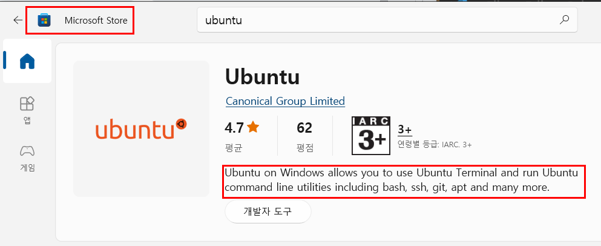

# Learning Linux essentials
> Linux is a family of open-source Unix-like operating systems based on the Linux kernel, an operating system kernel first released on September 17, 1991, by Linus Torvalds. Linux is typically packaged in a Linux distribution.

## Linux history
> During the formative years of the computer industry, one of the early operating systems was called Unix. It was designed to run as a multi-user system on mainframe computers, with users connecting to it remotely via individual terminals. These terminals were pretty basic by modern standards: just a keyboard and screen, with no power to run programs locally. 

> Instead they would just send keystrokes to the server and display any data they received on the screen. There was no mouse, no fancy graphics, not even any choice of colour. Everything was sent as text, and received as text. Obviously, therefore, any programs that ran on the mainframe had to produce text as an output and accept text as an input.

### Shell
> The original Unix shell program was just called sh, but it has been extended and superceded over the years, so on a modern Linux system you’re most likely to be using a shell called bash.

### Advantage of using text in terminal
> Compared with graphics, text is very light on resources. Even on machines from the 1970s, running hundreds of terminals across glacially slow network connections (by today’s standards), users were still able to interact with programs quickly and efficiently. 

> The commands were also kept very terse to reduce the number of keystrokes needed, speeding up people’s use of the terminal even more. This speed and efficiency is one reason why this text interface is still widely used today.

> When logged into a Unix mainframe via a terminal users still had to manage the sort of file management tasks that you might now perform with a mouse and a couple of windows. Whether creating files, renaming them, putting them into subdirectories or moving them around on disk, users in the 70s could do everything entirely with a textual interface.

### Linux as a descendent of Unix
> Linux is a sort-of-descendent of Unix. The core part of Linux is designed to behave similarly to a Unix system, such that most of the old shells and other text-based programs run on it quite happily. 

> In theory you could even hook up one of those old 1970s terminals to a modern Linux box, and access the shell through that. But these days it’s far more common to use a software terminal: that same old Unix-style text interface, but running in a window alongside your graphical programs. Let’s see how you can do that yourself!

## Ubuntu
> Ubuntu is a Linux distribution based on Debian and composed mostly of free and open-source software. Ubuntu is officially released in three editions: Desktop, Server and Core for Internet of things devices and robots. All the editions can run on the computer alone, or in a virtual machine. Ubuntu is a popular operating system for cloud computing, with support for OpenStack. Ubuntu's default desktop has been GNOME since version 17.10.

1. Desktop : Download Ubuntu desktop and replace your current operating system whether it’s Windows or macOS or run Ubuntu alongside it.

1. Server : Whether you want to configure a simple file server or build a fifty thousand-node cloud, you can rely on Ubuntu Server and its five years of guaranteed free upgrades.

1. Cloud : Ubuntu is the reference OS for OpenStack. Try Canonical OpenStack on a single machine or start building a production cloud on a cluster — just add servers.

## Installation
Go to Microsoft store and install Ubuntu LTS. 



> Ubuntu on Windows allows you to use Ubuntu Terminal and run Ubuntu command line utilities including bash, ssh, git, apt and many more. Please note that Windows 10 S does not support running this app.

> To launch, use "ubuntu" on the command-line prompt (cmd.exe), or click on the Ubuntu tile in the Start Menu. To use this feature, one first needs to use "Turn Windows features on or off" and select "Windows Subsystem for Linux", click OK, reboot, and use this app.

> The above step can also be performed using Administrator PowerShell prompt: Enable-WindowsOptionalFeature -Online -FeatureName Microsoft-Windows-Subsystem-Linux

> This app installs the Ubuntu 20.04 LTS release on Windows. Please note that app updates don't change the Ubuntu installation. To upgrade to a new release please run do-release-upgrade in the Ubuntu Terminal.

### Basic commands
- pwd : print working directory
```shell
# /root/jake
$pwd
```

- ls : list items in a current directory. 

```shell 
# list all items in root
$ls / 
```

- mkdir : make a directory
- rmdir : remove a directory
- clear : clear terminal
- cd : change directory

```shell
# ~ means home in Linux. 
$cd ~
```

- whoami : shows username
- touch : create a file
- rm : remove a file

```shell
# create a file called test.txt
$touch test.txt
# remove the file 
$rm test.txt
```

- cat : read a file
- mv : move a file to a directory

```shell 
# move a jake.txt file(source) to notJake directory(destination)
$mv jake.txt notJake
# rename a jake.txt to notJake.txt
$mv jake.txt notJake.txt
```

- man : checks a manual for command
```shell 
# fetch a command manual for mv
$man mv
```

<details>
<summary>hidden files in Linux</summary>

Linux makes a file hidden when the file name is prefixed with '.'. For example, 

```shell 
# hidden file
.vscode 
```
</details>


## Reference
- [Linux basic course - tutoriaLinux](https://youtube.com/playlist?list=PLtK75qxsQaMLZSo7KL-PmiRarU7hrpnwK)
- [Linux Command Line Tutorial For Beginners | Bash Terminal | Linux Terminal](https://youtube.com/playlist?list=PLS1QulWo1RIb9WVQGJ_vh-RQusbZgO_As)