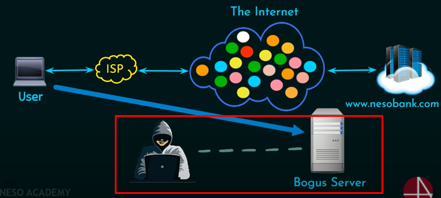

# Learning Cryptography and Network Security essentials
Internet is a public network where everyone can participate in, meaning there might be some of the hackers and attackers in the network. This is where the importance of security comes into play

## CIA triad
> The CIA triad is a widely used information security model that can guide an organization's efforts and policies aimed at keeping its data secure. 

>  the initials stand for the three principles on which infosec rests:

1. Confidentiality: Only authorized users and processes should be able to access or modify data
1. Integrity: Data should be maintained in a correct state and nobody should be able to improperly modify it, either accidentally or maliciously
1. Availability: Authorized users should be able to access data whenever they need to do so

## Reference 
- [Neso academy : cryptography and network security](https://www.youtube.com/watch?v=JoeiLuFNBc4&list=PLBlnK6fEyqRgJU3EsOYDTW7m6SUmW6kII&index=1)